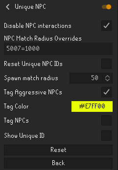
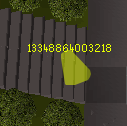

# UniqueNPC

## Description
This is a plugin designed to track and hide or tag NPCs that have been killed by the player.

## Features
- Unique ID creation based on NPC ID & kill location
- Unique IDs are entity locked for a session and are reassigned to a matching NPC ID based on proximity to death location

## Chat Commands
- ::npcstats returns total number of NPCs killed/assigned unique ID
- ::npccount <NpcId> returns # of unique IDs and assigned IDs for a specific NPC ID 
- Good for debugging and KC tracking

## Configuration
- Options to tag or hide NPCs
- Tag option for aggressive NPCs so player knows who is attacking them
- Option to menu entry swap to make NPCs unattackable
- Tag color selection
- Match distance for reassignment of unique IDs
- Reset saved unique IDs toggle

## Screenshots

## Compliance
This plugin does not automate gameplay and follows RuneLite and Jagex rules. The main function of this plugin is to track kills of each specific NPC to help with additional restriction modes.